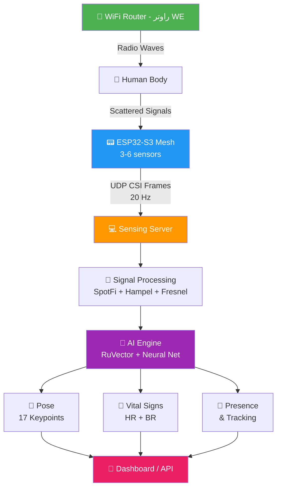
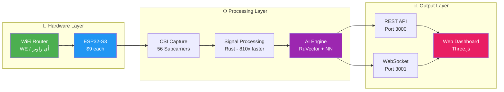
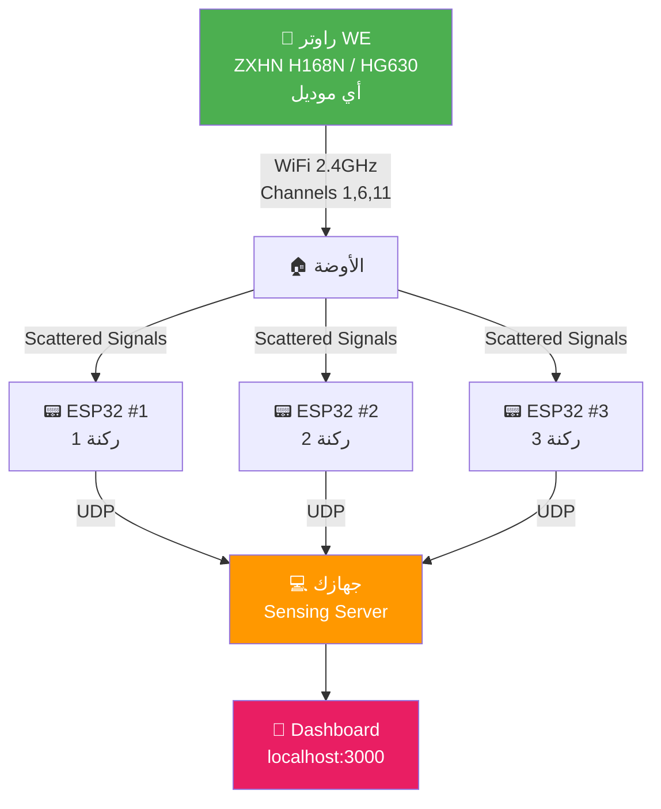
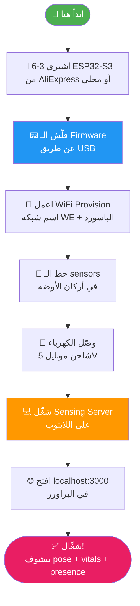
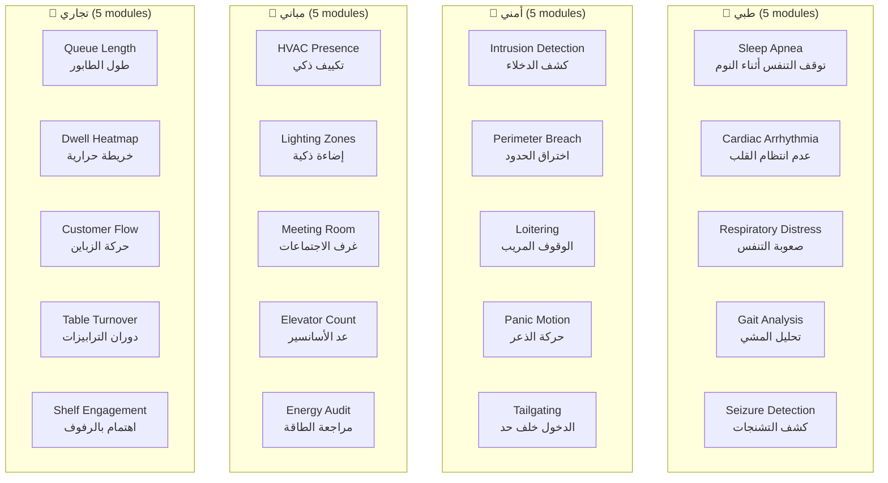

# 🇪🇬 RuView — الدليل الكامل بالعامية المصرية

<p align="center">
  
</p>

> **ملحوظة:** الملف ده مكتوب بالعامية المصرية مع mix من الإنجليزي عشان يبقى سهل على أي حد مصري يفهم المشروع ده بيعمل إيه وازاي يشغّله.

---

## 📑 الفهرس

- [يعني إيه RuView؟](#-يعني-إيه-ruview)
- [المشروع ده بيعمل إيه بالظبط؟](#-المشروع-ده-بيعمل-إيه-بالظبط)
- [الفيتشرز والمميزات](#-الفيتشرز-والمميزات)
- [ازاي الموضوع شغّال؟ (الشرح التقني)](#-ازاي-الموضوع-شغّال-الشرح-التقني)
- [إيه اللي هتحتاجه (Hardware)](#-إيه-اللي-هتحتاجه-hardware)
- [التشغيل على جهازك (Local Setup)](#-التشغيل-على-جهازك-local-setup)
- [التشغيل مع راوتر WE المصري](#-التشغيل-مع-راوتر-we-المصري)
- [الـ API والـ Endpoints](#-الـ-api-والـ-endpoints)
- [الـ CLI Commands](#-الـ-cli-commands)
- [حالات الاستخدام (Use Cases)](#-حالات-الاستخدام-use-cases)
- [الـ Edge Modules](#-الـ-edge-modules)
- [الأداء والسرعة (Performance)](#-الأداء-والسرعة-performance)
- [الأسئلة الشائعة (FAQ)](#-الأسئلة-الشائعة-faq)
- [لينكات مهمة](#-لينكات-مهمة)

---

## 🤔 يعني إيه RuView؟

**RuView** هو نظام **ذكاء اصطناعي بيشتغل على الـ Edge** (يعني على الجهاز نفسه، مش محتاج cloud).

**الفكرة ببساطة:** انت عندك WiFi في البيت أو الشغل، صح؟ الـ WiFi ده بيبعت موجات راديو (radio waves) في كل مكان. لما حد يتحرك أو حتى يتنفس، الموجات دي بتتأثر.

**RuView بيقرأ التأثير ده ويفهم منه:**
- 🚶 مين موجود في الأوضة
- 💓 معدل نبض القلب (heart rate)
- 🫁 معدل التنفس (breathing rate)
- 🧱 حتى لو وراء حيطة!

**يعني إيه ده؟** يعني انت ممكن تراقب صحة حد كبير في السن أو طفل من غير كاميرات، من غير أي حاجة يلبسها، وبجهاز تمنه **$9 بس** (ESP32-S3)!

> 💡 **الموضوع مبني على research من جامعة Carnegie Mellon** اللي عملوا ورقة بحثية اسمها *"DensePose From WiFi"* — RuView أخد الفكرة دي وحوّلها لنظام حقيقي يشتغل على أجهزة رخيصة.

---

## 🎯 المشروع ده بيعمل إيه بالظبط؟

### الرسم التوضيحي (System Overview)

```
┌─────────────────────────────────────────────────────────────────┐
│                    🏠 البيت أو المكتب بتاعك                      │
│                                                                 │
│   📡 راوتر WE ────── موجات WiFi ──────▶ 🧍 الشخص               │
│        │                                    │                   │
│        │          الموجات بترتد وبتتأثر      │                   │
│        │                                    ▼                   │
│        │              ┌──────────────────────────┐              │
│        └─────────────▶│   📟 ESP32-S3 Sensor     │              │
│                       │   (بيلقط الـ CSI Data)   │              │
│                       └────────────┬─────────────┘              │
│                                    │                            │
│                                    ▼ UDP                        │
│                       ┌──────────────────────────┐              │
│                       │  💻 Sensing Server        │              │
│                       │  (Rust أو Docker)        │              │
│                       └────────────┬─────────────┘              │
│                                    │                            │
│                    ┌───────────────┼───────────────┐            │
│                    ▼               ▼               ▼            │
│              🏃 Pose         💓 Vitals       👥 Presence        │
│           (وقفة الجسم)    (نبض + تنفس)    (مين موجود)          │
└─────────────────────────────────────────────────────────────────┘
```

### يعني إيه CSI؟

**CSI = Channel State Information**

الـ WiFi العادي بيديك RSSI (قوة السيجنال بس — عمود واحد). لكن الـ CSI بيديك **56 subcarrier** لكل frame — يعني 56 قيمة amplitude وphase في نفس الوقت!

```
RSSI (العادي):     ████████░░  ← رقم واحد بس (قوة السيجنال)

CSI (المتقدم):     ▁▃▅▇█▇▅▃▁▃▅▇█▇▅▃▁▃▅▇█▇▅▃▁▃▅▇█▇▅▃  ← 56 قيمة!
                   كل واحدة فيهم فيها amplitude + phase
```

لما حد يتحرك في الأوضة، الـ 56 قيمة دول بيتغيروا. الـ AI بيفهم من التغيير ده إيه اللي حصل.

---

## ⭐ الفيتشرز والمميزات

### 1. 📡 الاستشعار (Sensing)

| الميزة | يعني إيه؟ | السرعة |
|--------|-----------|--------|
| **Pose Estimation** (تقدير وقفة الجسم) | بيعرف الجسم واقف ازاي — 17 نقطة زي الكتف والركبة والراس | 54,000 fps |
| **Breathing Detection** (التنفس) | بيحس بالتنفس — من 6 لـ 30 نفس في الدقيقة | Real-time |
| **Heart Rate** (نبض القلب) | بيحس بنبض القلب — من 40 لـ 120 نبضة في الدقيقة | Real-time |
| **Presence Sensing** (مين موجود) | بيعرف لو في حد في الأوضة ولا لأ | أقل من 1ms |
| **Through-Wall** (عبر الحيطان) | بيشتغل حتى لو الشخص ورا حيطة! | لحد 5 متر |
| **Multi-Person** (أكتر من شخص) | بيتتبع كذا شخص في نفس الوقت | 3-5 أشخاص لكل AP |
| **Fall Detection** (كشف الوقوع) | لو حد وقع، بيبعتلك alert | أقل من 2 ثانية |

### 2. 🧠 الذكاء (Intelligence)

| الميزة | يعني إيه؟ |
|--------|-----------|
| **Self-Learning** | بيتعلم لوحده من الـ WiFi — مش محتاج كاميرات ولا data مجهزة |
| **Works Everywhere** | درّبه مرة واحدة واستخدمه في أي أوضة (مش لازم تدربه تاني) |
| **Room Fingerprint** | بيتعلم شكل الأوضة من الـ WiFi signals وبيفرّق بين الأوض |
| **Adaptive** | بيعدّل نفسه على حسب المكان — مش محتاج تظبطه يدوي |

### 3. ⚡ الأداء (Performance)

| الميزة | يعني إيه؟ |
|--------|-----------|
| **810x أسرع** | النسخة الـ Rust أسرع 810 مرة من Python |
| **54,000 fps** | بيعالج 54 ألف frame في الثانية |
| **شغّال Offline** | مش محتاج إنترنت خالص — كل حاجة local |
| **$9 بس** | بيشتغل على ESP32-S3 اللي تمنه 9 دولار |
| **Docker Ready** | `docker pull` وخلاص — 30 ثانية وتبقى شغّال |

---

## 🔬 ازاي الموضوع شغّال؟ (الشرح التقني)

### الـ Pipeline خطوة بخطوة

```
📡 Step 1: الراوتر (WE مثلاً) بيبعت WiFi waves في كل الأوضة
    │
    ▼
🧍 Step 2: الموجات بتضرب في جسم الإنسان وبترتد
    │
    ▼
📟 Step 3: الـ ESP32 sensors (3-6 قطع) بيلقطوا الـ CSI data
    │         على channels 1, 6, 11 بنظام TDM
    │
    ▼
🔀 Step 4: Multi-Band Fusion
    │         3 channels × 56 subcarriers = 168 virtual subcarriers
    │
    ▼
🎯 Step 5: Multistatic Fusion
    │         كل الـ sensors بيدمجوا البيانات مع بعض
    │         Attention-weighted cross-viewpoint embedding
    │
    ▼
✅ Step 6: Coherence Gate
    │         بيفلتر الـ data الوحشة ويسيب الحلوة بس
    │
    ▼
📊 Step 7: Signal Processing
    │         Hampel → SpotFi → Fresnel → BVP → Spectrogram
    │
    ▼
🧠 Step 8: AI Backbone (RuVector)
    │         Attention + Graph Algorithms + Compression
    │
    ▼
🤖 Step 9: Neural Network
    │         بيحوّل الـ signals لـ 17 body keypoints + vital signs
    │
    ▼
📱 Step 10: Output!
            Real-time pose + breathing + heart rate + room model
```

### Mermaid Diagram — Data Flow



### Mermaid Diagram — System Architecture



---

## 🔌 إيه اللي هتحتاجه (Hardware)

### الأجهزة المطلوبة

```
┌────────────────────────────────────────────────────────────┐
│                    الأجهزة المطلوبة                         │
├────────────────┬────────────┬──────────┬──────────────────┤
│ الجهاز          │ السعر      │ CSI كامل │ الوظيفة           │
├────────────────┼────────────┼──────────┼──────────────────┤
│ ESP32-S3 (8MB) │ ~$9 (~280ج)│ ✅ أيوه  │ سنسور WiFi CSI    │
│ ESP32-S3 Mini  │ ~$6 (~190ج)│ ✅ أيوه  │ سنسور صغير        │
│ أي لابتوب      │ $0         │ ❌ لأ    │ RSSI بس (بسيط)    │
│ Intel 5300 NIC │ ~$50       │ ✅ أيوه  │ Research grade     │
│ أي راوتر WiFi  │ عندك أصلاً  │ —       │ بيبعت الموجات      │
└────────────────┴────────────┴──────────┴──────────────────┘
```

### السيناريوهات

| المستوى | هتحتاج إيه | التكلفة | بيعمل إيه |
|---------|------------|---------|-----------|
| **مبتدئ** (بدون hardware) | لابتوب بس | $0 | RSSI presence detection بس + تجربة الـ pipeline بالـ simulation |
| **متوسط** (ESP32 واحد) | ESP32-S3 + راوتر WE | ~280 جنيه | Presence + vital signs + fall detection |
| **متقدم** (Mesh) | 3-6 ESP32-S3 + راوتر WE | ~850-1700 جنيه | Full pose estimation + multi-person + through-wall |
| **بحثي** (Research NIC) | Intel 5300 / Atheros | ~1500-3000 جنيه | Full CSI with 3x3 MIMO |

### ⚠️ أجهزة مش شغّالة

| الجهاز | ليه مش شغّال |
|--------|-------------|
| ESP32 (الأصلي) | Single-core — مش كفاية يشغّل الـ CSI DSP pipeline |
| ESP32-C3 | Single-core — نفس المشكلة |

> 💡 **لو مش عايز تشتري hardware:** ممكن تجرّب كل حاجة بالـ **simulation mode** أو بالـ **Docker** — هيديك demo data تلعب بيها.

---

## 💻 التشغيل على جهازك (Local Setup)

### الطريقة 1: Docker (الأسهل — 30 ثانية)

ده الطريق الأسرع لو عايز تجرب بسرعة:

```bash
# 1. حمّل الـ image
docker pull ruvnet/wifi-densepose:latest

# 2. شغّله
docker run -p 3000:3000 -p 3001:3001 -p 5005:5005/udp ruvnet/wifi-densepose:latest

# 3. افتح البراوزر
# http://localhost:3000
```

**كده خلاص!** 🎉 افتح البراوزر على `http://localhost:3000` وهتلاقي الـ dashboard شغّال.

#### Docker Ports

| البورت | بيعمل إيه |
|--------|-----------|
| `3000` | REST API + Web UI |
| `3001` | WebSocket (بيانات real-time) |
| `5005/udp` | استقبال بيانات من ESP32 |

### الطريقة 2: من الـ Source (Rust — الأسرع 810x)

```bash
# 1. انسخ الـ repo
git clone https://github.com/ruvnet/RuView.git
cd RuView

# 2. شغّل الـ installer
./install.sh --profile rust --yes

# أو يدوي:
cd rust-port/wifi-densepose-rs
cargo build --release

# 3. شغّل الـ server
cargo run -p wifi-densepose-sensing-server -- --http-port 3000 --source auto
```

### الطريقة 3: من الـ Source (Python)

```bash
# 1. انسخ الـ repo
git clone https://github.com/ruvnet/RuView.git
cd RuView

# 2. نزّل الـ dependencies
pip install -r requirements.txt
pip install -e .

# 3. شغّل الـ API
uvicorn v1.src.api.main:app --host 0.0.0.0 --port 8000

# أو بالـ Makefile
make run-api
```

### الطريقة 4: الـ Interactive Installer

```bash
# شغّل الـ installer — هيسألك أسئلة ويختار أحسن profile ليك
./install.sh

# أو اختار profile معين
./install.sh --profile verify --yes    # تجربة بسيطة (5 MB)
./install.sh --profile python --yes    # Python كامل (500 MB)
./install.sh --profile rust --yes      # Rust (200 MB — الأسرع)
./install.sh --profile docker --yes    # Docker (1 GB)
./install.sh --profile full --yes      # كل حاجة (2 GB)
```

### متطلبات النظام

```
┌────────────────────────────────────────────┐
│             System Requirements            │
├────────────────────┬───────────────────────┤
│ الحاجة             │ المطلوب               │
├────────────────────┼───────────────────────┤
│ Operating System   │ Linux / macOS / Win10 │
│ RAM                │ 4 GB (minimum)        │
│                    │ 8 GB (recommended)    │
│ Storage            │ 2 GB فاضي             │
│ Python             │ 3.8+                  │
│ Rust               │ 1.70+                 │
│ Docker             │ أي version حديث       │
│ GPU                │ اختياري (CUDA/Metal)  │
└────────────────────┴───────────────────────┘
```

### التحقق إن كل حاجة شغّالة

```bash
# تأكد إن الـ signal processing pipeline شغّال صح
python v1/data/proof/verify.py
# المفروض يطلّعلك: VERDICT: PASS ✅

# شغّل الـ Rust tests
cd rust-port/wifi-densepose-rs
cargo test --workspace --no-default-features
# المفروض: 1,031+ tests passed, 0 failed ✅

# أو بالـ Makefile
make verify           # يتحقق من الـ pipeline
make test-rust        # يشغّل كل الـ Rust tests
```

---

## 📡 التشغيل مع راوتر WE المصري

### أهم حاجة تعرفها

> **RuView بيشتغل مع أي راوتر WiFi — مش بس WE!**
>
> الراوتر بتاعك (WE أو TP-Link أو أي حاجة) هو بس مصدر الموجات. الشغل الحقيقي بيتعمل في الـ ESP32 sensors اللي بتلقط الـ CSI data.

### Mermaid Diagram — WE Router Setup



### Setup خطوة بخطوة مع راوتر WE

#### Step 1: جهّز الراوتر

مش محتاج تغيّر أي حاجة في الراوتر! بس تأكد من كام حاجة:

```
✅ الراوتر شغّال وبيبث WiFi (ده أكيد لو بتستخدم النت 😄)
✅ الـ WiFi على 2.4 GHz (ده الـ default في أغلب راوترات WE)
✅ اعرف اسم الشبكة (SSID) والباسورد
```

**أشهر راوترات WE:**

| الموديل | بيشتغل؟ | ملاحظات |
|---------|---------|---------|
| ZXHN H168N | ✅ أيوه | الأشهر في مصر — شغّال ممتاز |
| ZXHN H188A | ✅ أيوه | الموديل الجديد — شغّال كمان |
| HG630 V2 | ✅ أيوه | موديل قديم بس شغّال |
| HG633 | ✅ أيوه | شغّال عادي |
| DG8045 | ✅ أيوه | Dual-band — استخدم 2.4GHz |
| أي راوتر WE تاني | ✅ أيوه | كلهم بيشتغلوا — المهم يكون فيه WiFi 2.4GHz |

> 💡 **ليه 2.4GHz؟** لأن الـ 2.4GHz بيعدّي من الحيطان أحسن من 5GHz. وكمان الـ ESP32 بيشتغل على 2.4GHz بس.

#### Step 2: وصّل الـ ESP32-S3 Sensors

**اشتري الأجهزة:**
- 3-6 × ESP32-S3 (8MB flash) — حوالي 280 جنيه الواحد من AliExpress أو من محلات الإلكترونيات في مصر
- USB cables عشان تفلّشهم أول مرة
- Power supply (شاحن موبايل عادي 5V)

**الخريطة (Placement Map):**

```
┌─────────────────────────────────────────┐
│              🏠 الأوضة (5م × 4م)         │
│                                         │
│  📟 ESP32 #1 ─ ─ ─ ─ ─ ─ ─ 📟 ESP32 #2 │
│  (ركنة فوق شمال)          (ركنة فوق يمين)│
│       │                        │        │
│       │    📡 راوتر WE         │        │
│       │    (في النص فوق)       │        │
│       │                        │        │
│       │      🧍 الشخص          │        │
│       │      (في النص)         │        │
│       │                        │        │
│  📟 ESP32 #3 ─ ─ ─ ─ ─ ─ ─ 📟 ESP32 #4 │
│  (ركنة تحت شمال)          (ركنة تحت يمين) │
│                                         │
│  💻 اللابتوب بتاعك (في أي مكان)         │
└─────────────────────────────────────────┘

المسافة بين كل ESP32 والتاني: 2-4 متر (ideal)
ارتفاع التركيب: 1.5-2 متر من الأرض
```

> 💡 **نصيحة:** حط الـ sensors في أركان الأوضة عشان تغطي 360 درجة. كل ما زوّدت sensors، كل ما الدقة بقت أحسن.

#### Step 3: فلّش الـ Firmware على الـ ESP32

```bash
# 1. ابني الـ firmware (محتاج Docker)
MSYS_NO_PATHCONV=1 docker run --rm \
  -v "$(pwd)/firmware/esp32-csi-node:/project" -w /project \
  espressif/idf:v5.2 bash -c \
  "idf.py set-target esp32s3 && idf.py build"

# 2. فلّش على الـ ESP32 (وصّله بالـ USB الأول)
python -m esptool --chip esp32s3 --port /dev/ttyUSB0 --baud 460800 write_flash \
  0x0 build/bootloader/bootloader.bin \
  0x8000 build/partition_table/partition-table.bin \
  0x10000 build/esp32-csi-node.bin

# على Windows: غيّر /dev/ttyUSB0 لـ COM7 (أو الـ port بتاعك)
```

#### Step 4: اعمل Provision للـ WiFi

ده الخطوة اللي بتقول فيها للـ ESP32 يتوصّل على شبكة WE:

```bash
# عدّل الـ SSID والـ password حسب شبكتك
python scripts/provision.py \
  --port /dev/ttyUSB0 \
  --ssid "WE_XXXX" \
  --password "الباسورد_بتاع_الراوتر" \
  --target-ip 192.168.1.X

# على Windows:
python scripts/provision.py \
  --port COM7 \
  --ssid "WE_XXXX" \
  --password "الباسورد_بتاع_الراوتر" \
  --target-ip 192.168.1.X
```

> **ملحوظة:** الـ `target-ip` ده IP اللابتوب بتاعك على شبكة WE. اعرفه من:
> - **Windows:** `ipconfig` في الـ CMD
> - **Linux:** `ip addr` أو `ifconfig`
> - **macOS:** System Preferences → Network

#### Step 5: شغّل الـ Sensing Server

```bash
# Rust (الأسرع — recommended)
cd rust-port/wifi-densepose-rs
cargo run -p wifi-densepose-sensing-server -- \
  --http-port 3000 \
  --source esp32

# أو بالـ Docker
docker run -p 3000:3000 -p 3001:3001 -p 5005:5005/udp \
  ruvnet/wifi-densepose:latest
```

#### Step 6: افتح الـ Dashboard

افتح البراوزر على: **http://localhost:3000** 🎉

### المخطط الكامل (Full WE Setup Flow)



### لو مش عايز تشتري ESP32 (Simulation Mode)

ممكن تجرب كل حاجة بدون أي hardware:

```bash
# Rust simulation
cargo run -p wifi-densepose-sensing-server -- \
  --http-port 3000 \
  --source simulate

# أو Docker (بيشتغل بـ demo data تلقائياً)
docker run -p 3000:3000 ruvnet/wifi-densepose:latest
```

### لو عندك لابتوب بس (RSSI Mode)

حتى من غير ESP32، لو عندك WiFi في اللابتوب، ممكن تستخدم RSSI mode:

```bash
cargo run -p wifi-densepose-sensing-server -- \
  --http-port 3000 \
  --source wifi
```

> ⚠️ **ملحوظة:** الـ RSSI mode ده بسيط — بيديك presence detection بس (مين موجود ومين لأ). عشان vital signs وpose estimation، محتاج ESP32.

---

## 🔗 الـ API والـ Endpoints

### REST API (HTTP)

لما الـ server يشتغل، ممكن تتعامل معاه عن طريق HTTP requests:

#### Health & Status

```bash
# هل الـ server شغّال؟
curl http://localhost:3000/health

# معلومات عن الـ server
curl http://localhost:3000/api/v1/info

# Status كامل
curl http://localhost:3000/api/v1/status

# Metrics (Prometheus format)
curl http://localhost:3000/metrics
```

#### Sensing Data

```bash
# آخر frame من الـ sensing
curl http://localhost:3000/api/v1/sensing/latest

# Vital signs (نبض + تنفس)
curl http://localhost:3000/api/v1/vital-signs

# Pose الحالي
curl http://localhost:3000/api/v1/pose/current

# مين موجود في كل zone
curl http://localhost:3000/api/v1/pose/zones/summary
```

#### Recording & Training

```bash
# ابدأ تسجيل CSI data
curl -X POST http://localhost:3000/api/v1/recording/start

# وقّف التسجيل
curl -X POST http://localhost:3000/api/v1/recording/stop

# ابدأ training
curl -X POST http://localhost:3000/api/v1/train/start
```

### WebSocket (Real-time)

لو عايز data في real-time (بتتحدث كل frame):

```python
import asyncio, websockets, json

async def live_stream():
    async with websockets.connect("ws://localhost:3001/ws/sensing") as ws:
        async for msg in ws:
            data = json.loads(msg)
            persons = data.get('persons', [])
            vitals = data.get('vitals', {})
            print(f"👥 عدد الأشخاص: {len(persons)}")
            print(f"💓 نبض القلب: {vitals.get('heart_rate', 'N/A')} bpm")
            print(f"🫁 التنفس: {vitals.get('breathing_rate', 'N/A')} bpm")
            print("---")

asyncio.run(live_stream())
```

### الـ Response بيبقى شكله إيه؟

```json
{
  "timestamp": "2025-01-01T12:00:00Z",
  "persons": [
    {
      "id": 1,
      "keypoints": [120.5, 80.3, 0.95, ...],
      "confidence": 0.95,
      "bbox": [100, 50, 200, 300]
    }
  ],
  "vitals": {
    "breathing_rate": 16,
    "heart_rate": 72,
    "presence": true,
    "motion_energy": 0.45
  }
}
```

---

## 🖥️ الـ CLI Commands

### Python CLI

```bash
wifi-densepose start          # شغّل الـ API server
wifi-densepose stop           # وقّف الـ server
wifi-densepose status         # شوف الـ status

# أو الاختصار
wdp start
wdp stop
wdp status
```

### Rust CLI (الرئيسي)

```bash
# Sensing Server
cargo run -p wifi-densepose-sensing-server -- \
  --http-port 3000 \
  --ws-port 3001 \
  --source auto \            # auto / esp32 / simulate / wifi
  --model path/to/model.rvf  # اختياري — لو عندك model مدرّب

# Disaster Response (WiFi-Mat)
wifi-densepose mat scan           # ابحث عن ناجين
wifi-densepose mat status         # status الـ scan
wifi-densepose mat survivors      # قايمة الناجين المكتشفين
wifi-densepose mat alerts         # التنبيهات
wifi-densepose mat export         # Export النتايج (JSON/CSV)
```

### Makefile Commands

```bash
make install          # Guided installer (بيسألك أسئلة)
make install-rust     # نزّل Rust pipeline
make install-python   # نزّل Python pipeline
make install-docker   # نزّل Docker setup
make install-full     # كل حاجة

make verify           # تحقق من الـ signal processing
make build-rust       # ابني الـ Rust (release mode)
make test-rust        # شغّل 1,300+ test
make run-api          # شغّل Python API (port 8000)
make run-viz          # شغّل الـ visualization (port 3000)
make run-docker       # شغّل بالـ Docker Compose
make clean            # نضّف الـ build artifacts
```

---

## 🏢 حالات الاستخدام (Use Cases)

### 🏥 الصحة (Healthcare)

```
┌──────────────────────────────────────────────┐
│          🏥 رعاية كبار السن                    │
│                                              │
│  📟 ESP32 في أوضة الجد/الجدة                  │
│       │                                      │
│       ├── 💤 مراقبة التنفس أثناء النوم         │
│       ├── 🚨 كشف الوقوع (fall detection)      │
│       ├── 💓 متابعة نبض القلب                  │
│       └── 📱 إنذار على موبايلك لو حصل حاجة    │
│                                              │
│  التكلفة: ESP32 واحد بس (~280 جنيه)          │
│  مش محتاج: كاميرات / wearables / إنترنت      │
└──────────────────────────────────────────────┘
```

### 🏠 البيت الذكي (Smart Home)

| الحاجة | إزاي بيعملها |
|--------|-------------|
| الإضاءة | لما تدخل الأوضة — النور يولّع. لما تخرج — يطفي |
| التكييف | لما تكون موجود — يشتغل. لما تمشي — يطفي (توفير 15-30%) |
| السخّان | يسخّن قبل ما تقوم من النوم (بيتعلم الروتين بتاعك) |
| الأمان | لو حد دخل البيت وانت مش موجود — إنذار |

### 🏪 المحلات والأعمال

| الحاجة | إزاي بيعملها |
|--------|-------------|
| عدد الزباين | بيعد الناس اللي داخلة وخارجة |
| أماكن الزحمة | بيعرف أنهي رف الزباين واقفة قدامه أكتر |
| الطوابير | بيقدّر طول الطابور ووقت الانتظار |
| كفاءة المكان | بيعرف أنهي أماكن مستخدمة وأنهي فاضية |

### 🚨 الطوارئ والإنقاذ (Disaster Response)

```
┌──────────────────────────────────────────────┐
│          🚨 WiFi-Mat: البحث عن ناجين           │
│                                              │
│  بعد زلزال أو انهيار مبنى:                    │
│                                              │
│  📟 ESP32 mesh حوالين الأنقاض                  │
│       │                                      │
│       ├── 🔍 كشف تنفس تحت 30cm خرسانة        │
│       ├── 📍 تحديد مكان الناجي بالـ 3D         │
│       ├── 🏥 تصنيف خطورة الإصابة (START)       │
│       └── 📊 Dashboard للفريق الإنقاذ          │
│                                              │
│  ** بيشتغل من غير إنترنت أو كهرباء **         │
│     (الـ ESP32 بيشتغل على بطارية)              │
└──────────────────────────────────────────────┘
```

---

## 🧩 الـ Edge Modules

الـ Edge Modules دي برامج صغيرة (5-30 KB) بتتحمّل على الـ ESP32 مباشرة. كل module بيعمل حاجة معينة:



**المجموع: 65+ module كلهم شغّالين ومتجرّبين (609 tests passing)** 🎉

### أمثلة تانية من الـ Modules

| الفئة | أمثلة |
|-------|-------|
| 🏭 **صناعي** | كشف اقتراب الرافعات، مراقبة أماكن ضيقة، اهتزاز المباني |
| 🔮 **بحثي** | تصنيف مراحل النوم، كشف المشاعر، لغة الإشارة، كشف المطر |
| 📡 **Signal Intelligence** | Flash Attention، Coherence Gate، Sparse Recovery |
| 🧠 **Adaptive Learning** | DTW Gesture Learn، Meta Adapt، EWC Lifelong |
| 🛡️ **AI Security** | كشف Replay Attacks، WiFi Jamming، Injection |
| 🤖 **Autonomous** | Self-Healing Mesh، GOAP Autonomy |

---

## 📊 الأداء والسرعة (Performance)

### Rust vs Python

```
┌───────────────────────────────────────────────────────┐
│                   ⚡ مقارنة السرعة                     │
│                                                       │
│  العملية              │ Python  │ Rust    │ أسرع بكام │
│  ───────────────────  │ ──────  │ ──────  │ ───────── │
│  Full Pipeline        │  100x   │  ██████ │  810x     │
│  Motion Detection     │  100x   │  ██████ │  5,400x   │
│  Vital Signs          │  100x   │  ██████ │  11,665fps│
│  CSI Processing       │  100x   │  ██████ │  54,000fps│
│  Docker Image Size    │  569MB  │  132MB  │  4.3x أصغر│
│                                                       │
│  ██████ = Rust (الأسرع)                                │
└───────────────────────────────────────────────────────┘
```

### الأرقام المهمة

| المقياس | القيمة |
|---------|--------|
| Pipeline speed | 54,000 fps |
| Vital signs processing | 11,665 fps |
| Presence latency | < 1ms |
| Fall detection alert | < 2 seconds |
| Full pipeline latency | < 100 microseconds/frame |
| Docker image (Rust) | 132 MB |
| Tests passing | 1,300+ |
| ESP32 model size | 55 KB |

---

## ❓ الأسئلة الشائعة (FAQ)

### هل محتاج أغيّر حاجة في راوتر WE؟
**لأ خالص!** الراوتر بيشتغل عادي — مش محتاج تغيّر أي setting. الـ ESP32 بيلقط الموجات من الهوا.

### هل بيأثر على سرعة الإنترنت؟
**لأ.** الـ sensors بتلقط الموجات بشكل passive — يعني بتسمع بس مش بتتكلم. مافيش أي تأثير على الإنترنت بتاعك.

### هل لازم ESP32-S3؟ مش أي ESP32 يمشي؟
**لازم S3!** الـ ESP32 الأصلي والـ C3 عندهم core واحد — مش كفاية يشغّل الـ DSP pipeline. الـ S3 عنده 2 cores ودي الـ minimum.

### كام ESP32 محتاج؟
- **1 sensor:** Presence + vital signs (كافي لأوضة صغيرة)
- **3-4 sensors:** Full pose estimation (أوضة عادية)
- **6 sensors:** Maximum accuracy + multi-person (مكان كبير)

### بيشتغل من غير إنترنت؟
**أيوه!** كل حاجة local — مش محتاج إنترنت بعد ما تعمل الـ setup الأولي. حتى الـ ESP32 بيشتغل standalone.

### بيشتغل على الموبايل؟
**أيوه!** في React Native app + Web dashboard responsive. افتح `localhost:3000` من أي جهاز على نفس الشبكة.

### هل الخصوصية محفوظة؟
**أيوه 100%!** مافيش كاميرات، مافيش صور، مافيش فيديو. كل البيانات أرقام (WiFi signals). ومافيش حاجة بتتبعت لأي cloud.

### ينفع أستخدمه في الشغل / المحل؟
**أيوه!** شوف قسم [حالات الاستخدام](#-حالات-الاستخدام-use-cases) — في سيناريوهات للمستشفيات، المحلات، المكاتب، المصانع، وحتى الإنقاذ في الكوارث.

### لو عندي مشكلة، ألاقي مساعدة فين؟
- **GitHub Issues:** https://github.com/ruvnet/RuView/issues
- **Discussions:** https://github.com/ruvnet/RuView/discussions
- **الـ User Guide:** [docs/user-guide.md](user-guide.md)

---

## 🔗 لينكات مهمة

| الحاجة | اللينك |
|--------|--------|
| 📖 User Guide | [docs/user-guide.md](user-guide.md) |
| 🔧 Build Guide | [docs/build-guide.md](build-guide.md) |
| 📡 Live Demo | [ruvnet.github.io/RuView](https://ruvnet.github.io/RuView/) |
| 🎯 Pose Fusion Demo | [ruvnet.github.io/RuView/pose-fusion.html](https://ruvnet.github.io/RuView/pose-fusion.html) |
| 🏥 WiFi-Mat Guide | [docs/wifi-mat-user-guide.md](wifi-mat-user-guide.md) |
| 📊 Architecture Decisions | [docs/adr/README.md](adr/README.md) |
| 🐳 Docker Hub | [hub.docker.com/r/ruvnet/wifi-densepose](https://hub.docker.com/r/ruvnet/wifi-densepose) |
| 📦 crates.io | [crates.io/crates/wifi-densepose-core](https://crates.io/crates/wifi-densepose-core) |
| 🐛 Bug Reports | [GitHub Issues](https://github.com/ruvnet/RuView/issues) |
| 💬 Community | [GitHub Discussions](https://github.com/ruvnet/RuView/discussions) |

---

## 🗺️ خريطة المشروع (Project Structure)

```
RuView/
├── 📁 v1/                          ← Python implementation (legacy)
│   ├── src/api/                    ← REST API (FastAPI)
│   ├── src/sensing/                ← RSSI collector
│   ├── src/models/                 ← Neural networks
│   ├── tests/                      ← Python tests
│   └── data/proof/                 ← Deterministic verification
│
├── 📁 rust-port/wifi-densepose-rs/ ← Rust implementation (الأسرع 810x)
│   └── crates/                     ← 18 modular crates
│       ├── wifi-densepose-core/       ← Types + traits
│       ├── wifi-densepose-signal/     ← Signal processing + RuvSense
│       ├── wifi-densepose-nn/         ← Neural network inference
│       ├── wifi-densepose-mat/        ← Disaster response
│       ├── wifi-densepose-vitals/     ← Vital signs (HR + BR)
│       ├── wifi-densepose-hardware/   ← ESP32 drivers
│       ├── wifi-densepose-sensing-server/ ← Main server
│       ├── wifi-densepose-wasm/       ← Browser WASM
│       ├── wifi-densepose-wasm-edge/  ← Edge modules (65+)
│       └── ...                        ← 9 more crates
│
├── 📁 firmware/esp32-csi-node/     ← ESP32 firmware (C)
│   ├── main/                       ← WiFi CSI capture
│   └── components/                 ← DSP, WASM runtime, NVS
│
├── 📁 ui/                          ← Web UI
│   ├── observatory/                ← 3D Dashboard (Three.js)
│   ├── pose-fusion/                ← Dual-modal pose viewer
│   └── mobile/                     ← React Native app
│
├── 📁 docs/                        ← Documentation
│   ├── adr/                        ← 43+ Architecture Decision Records
│   ├── ddd/                        ← Domain-Driven Design models
│   ├── edge-modules/               ← Edge module documentation
│   └── GUIDE-AR-EG.md             ← 🇪🇬 الملف ده!
│
├── 📁 docker/                      ← Docker configs
├── 📁 examples/                    ← Usage examples
├── 📁 scripts/                     ← Utility scripts
├── 📄 install.sh                   ← Interactive installer
├── 📄 Makefile                     ← Build commands
├── 📄 README.md                    ← Main documentation
└── 📄 example.env                  ← Environment config template
```

---

## 🎓 ملخص سريع (TL;DR)

```
┌─────────────────────────────────────────────────────────────┐
│                                                             │
│   🇪🇬 RuView باختصار شديد:                                  │
│                                                             │
│   ✅ بيشوف الناس من خلال WiFi (من غير كاميرات)              │
│   ✅ بيحس بالتنفس ونبض القلب (من غير أي جهاز يتلبس)        │
│   ✅ بيشتغل على جهاز بـ $9 (ESP32-S3)                      │
│   ✅ بيشتغل مع أي راوتر WE في مصر                          │
│   ✅ مش محتاج إنترنت                                        │
│   ✅ الخصوصية محفوظة 100% (مافيش كاميرات ولا صور)           │
│   ✅ Open Source (MIT License)                               │
│   ✅ 1,300+ test كلهم passing                                │
│   ✅ Docker → 30 ثانية وتبقى شغّال                          │
│                                                             │
│   🚀 ابدأ دلوقتي:                                           │
│   docker pull ruvnet/wifi-densepose:latest                   │
│   docker run -p 3000:3000 ruvnet/wifi-densepose:latest       │
│   افتح: http://localhost:3000                                │
│                                                             │
└─────────────────────────────────────────────────────────────┘
```

---

<p align="center">
  <strong>🇪🇬 اتعمل بحب من مصر — Made with ❤️</strong>
  <br>
  <a href="https://github.com/ruvnet/RuView">GitHub</a> · 
  <a href="https://github.com/ruvnet/RuView/issues">Issues</a> · 
  <a href="https://github.com/ruvnet/RuView/discussions">Discussions</a>
</p>
